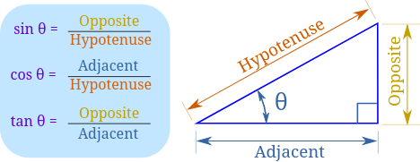
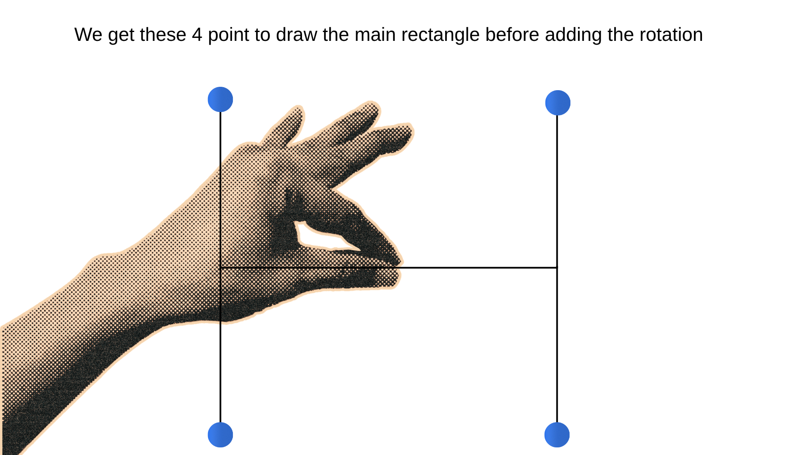
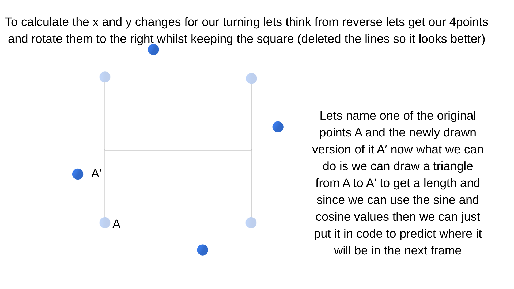
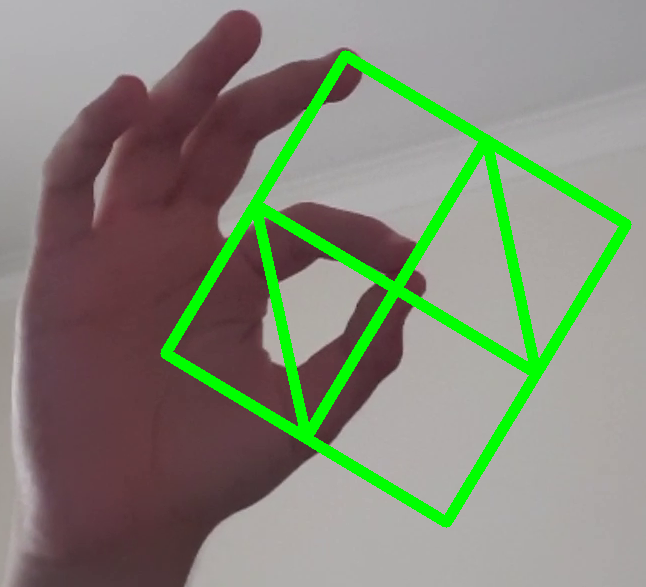

# MorbidVisuals

In this project we will explore Google's Mediapipe and see what we can do with it to alter realtime videos or normal videos in general.
You can access the projects demo in here https://20cuneyt10.github.io/MorbidVisuals/
First we need to download the Mediapipe library I will be using a venv for this and I suggest you do too.

for creating a venv you can use 

```bash
python -m venv yourenvname
```

And once you have done that you can activate the enviroment by 

```bash
source ./yourenvname/bin/activate
```
(extension of this may change according to your terminal .fish/.ps1/.csh since i am rocking a fish terminal i will be using .fish)

then to install the mediapipe library you can type in

```bash
python -m pip install mediapipe
```

For our first project we will be doing just hand landmark tracking and projecting the hand landmarks with opencv.
Opencv is a powerful and useful library used in many projects that include computer vision,image processing and machine learning. You can download opencv using

```bash
python -m pip install opencv-python
```

to import mediapipe and opencv you can use 

```python
import cv2
import mediapipe as mp
from mediapipe.tasks import python
from mediapipe.tasks.python import vision
```

!Important: Many tutorials that are older might include mediapipe.solutions() but that is deprecated I wouldn't recommend using this but you can through downloading older versions of the mediapipe library.

To get started with our hand landmarking project we first have to download a model from mediapipes model library you can get the basic hand landmark model using this command 

```bash
wget -q https://storage.googleapis.com/mediapipe-models/hand_landmarker/hand_landmarker/float16/1/hand_landmarker.task
```

Or you can get it through Mediapies own guide.
After that you should put your model path in your code

```python
model_path = "your/path/to/your/hand_landmarker.task"
```

There are multiple settings you need to setup to use mediapipe and do hand landmark detection some of those are 

```python
BaseOptions = mp.tasks.BaseOptions
HandLandmarker = mp.tasks.vision.HandLandmarker
HandLandmarkerOptions = mp.tasks.vision.HandLandmarkerOptions

options = HandLandmarkerOptions(
    base_options=BaseOptions(model_asset_path=model_path), # You could just put 
    the model path here but i did it like this to keep this part organized
    running_mode=mp.tasks.vision.RunningMode.IMAGE, # Specifies running in single frame mode
    num_hands=2 #Just specifies the number of hands
)
```

İf you want more configuration you might like looking at https://developers.google.com/edge/mediapipe/solutions/vision/gesture_recognizer which also has a lot of useful information in general.
and for opencv we need to setup our window and our video source 

```python
cam = cv.VideoCapture(0) #Setting up the camera you might need to change the value in the parenthesis to use other video sources you have connected for example for me it was 2 because I used Iriun webcam
cam.set(3, 1280)#setting width
cam.set(4, 720)#setting height
```

Now that we are fully set up we can do our landmark detection by using the mp.image to pass our frame to the landmarker model and get the results (we also turn the image to RGB while doing so)

After that we use the results we get alongside the width and height attributes of our frame and use those values times each other to draw circles on the coordinates that the landmarks are. But before we jump into there I want to talk about what info we get from mediapipe.


We get 21 distinct landmarks we can use to make all kinds of applications such as basic gesture recognition ,a dynamic drawing tool or a tool that uses your hand as a volume knob for your pc(all off which we will try to do in this project)

Now lets get back to our own first try of just displaying the hand landmarks.


We get the cx and cy coordinates then draw circles around them with the simple cv2.circle function


then we can just show our frame, add a stopping and a cleanup logic at the end 

```python
        cv2.imshow("Show Video", cv2.flip(frame, 1))
        if cv2.waitKey(1) & 0xFF == ord('q'): break

cam.release()
cv2.destroyAllWindows()
```

There we go now we can display our hand landmarks correctly and accurately. In the next project we will use these hand landmarks to draw with our fingers.

Now we can use the information we learned and explore the result function a bit further.

<h1>Learning fundementals of result and experimenting</h1>

The setup for our project remains the same until the circle drawing logic. To understand how we can take info of 21 distinct points we have to look at how the results function works.
We have 2 main uses of our results the first function is result.hand_world_landmarks and the other is result.hand_landmarks The difference beetween these 2 functions are the world landmarks gives distance relative to your hands wrist in metric format while the normal hand landmark function gives you normalized coordinates(1-0) relative to your cameras width and height. 

But why do we need the world hand landmark when we can just use normal hand landmark. 


As you can see in the image the distance between the 2 points stays same but the pixels get lesser and lesser so we cant rely on the frame relative hand_landmark function and we must use the hand relative hand_world_landmark to get the distance between the two fingers so we can use them later in the code.

To get one points location we need to call it from the results then assign it to a variable to use it more efficiently

```python
jointA = result.hand_world_landmarks[0][8] # specifying the exact point of 08 which is index tip
jointB = result.hand_world_landmarks[0][4] # specifying the exact point of 04 which is thumb tip
x1,y1,z1 = jointA.x,jointA.y,jointA.z
x2,y2,z2 = jointB.x,jointB.y,jointB.z
```

we can then use these values to check if the finger tips are close together 

```python
if abs(x1 - x2) <0.015 and abs(y1 - y2) <0.008 :# you might need to mess with these values to make them work better
    print("Finger tips are close together")
```

then we need something else to make our script more fun. What about drawing a line from the thumb tip to index tip everytime we dont detect a pinch and for that we need the frame relative hand_landmark positions we get those by 

```python
jAnormal = result.hand_landmarks[0][8]
jBnormal = result.hand_landmarks[0][4]
```

and we get the needed values and assign them to variables with

```python
h,w,_=frame.shape
bx = int(jBnormal.x*w)
by = int(jBnormal.y*h)
cx = int(jAnormal.x*w)
cy = int(jAnormal.y*h)
```

and after that we just add a else after our circle drawing logic which just means we will do this everytime we aren't pinching. And also use the cv2.line function to draw a line between 2 points the basic parameters for cv2.line is 


Then we can just show the image and add the cleanup code and there you have your line ,drawing pinch detecting, circle drawing code ready at your fingertips which we can now track. 

Now lets try something else, lets try drawing a line but while also asssigning points in space so the line stays true to those points then we can add a keybind to clear the line to get ready for making a new one.

The basic logic is still the same as the last script we get our variables like the frames height and width and we get the tip of the both fingers as we need them for the pinching detection.

But now we will first need to assign something outside the while loop so we dont reset the values to 0 or True everyime the loop runs. For this experiment we will have 4 different variables that will contain our coordinates for the drawing
```python
tx = 0
ty = 0
lx = 0
ly = 0
```
And one state for to not set both of the points in the same instance 
```python
is_touching = False
```
Now lets get into the code. When we detect the pinch for the first time we throw and if statement to see if tx = zero if it is equal to zero we assign the value of bx and by to tx and ty .In doing this we have basically stored that point in 2 variables.
```python
if tx == 0: 
    tx,ty = bx,by
    is_touching = True
```
And we have an elif in the pinching check too which states
```python
elif tx != 0 and lx == 0 and is_touching == True :
    lx,ly = cx,cy
```
This just tells that if tx isn't equal to zero(which means it has been assigned) and lx is equal to zero(which means it hasn't been assigned)and is is_touching equal to False which prevents the points lx,ly being the same as tx,ty, set lx,ly equals to cx,cy. This is also why we set the is_touching to True in the assignment of tx,ty so we can turn it to False when we go back to line drawing mode. 
```python
elif tx != 0 and lx == 0:
    cv2.line((frame),pt1=(tx,ty),pt2=(cx,cy),color=(0,255,0),thickness=10)
    is_touching = True
``` 
This is what happens when only the first pinch has  happened (if tx isn't zero it means that it has been assigned but we also have a and which is if lx is equal to zero which means it hasn't been assigned yet)so we draw a line from tx,ty to cx,cy(could have used bx,by too)which just shows us what our line would look like if we put the second point down in cx,cy(which is our index tip).

We also have an else function inside the pinching state
to draw the line in our newly depicted 2 points which we added so the line doesnt disappear when we pinch 
```python
else:
    cv2.line((frame),pt1=(tx,ty),pt2=(lx,ly),color=(0,255,0),thickness=10)
 ```
 And last but notleast we need to add an final line draw logic and cleanup script out of the pinching logic
 ```python
                 elif tx != 0 and lx != 0:
                    cv2.line((frame),pt1=(tx,ty),pt2=(lx,ly),color=(0,255,0),thickness=10)
                    if cv2.waitKey(1) & 0xFF == ord('c'):
                        tx = 0
                        ty = 0
                        lx = 0
                        ly = 0
  
                else:
                    cv2.line((frame),pt1=(bx,by),pt2=(cx,cy),color=(0,255,0),thickness=10)
     

        cv2.imshow("Show Video", cv2.flip(frame, 1))
        if cv2.waitKey(1) & 0xFF == ord('q'): break

cam.release()
cv2.destroyAllWindows()
```
This is basically a script to draw the new line if tx and lx are both assigned and if we dont mach any if's it just draws the normal line from tip to tip. We also add a keybind to set all 4 values of new points to zero so we can reuse it without closing the script.In our next project we will try to keep the lines we draw and draw polygons using our last point.

In the next part of our project we will draw a turning square with another square inside of it. For this project we will use sine and cosine which is just



Sourced from mathsisfun.com

You will need to import the math library for this you can do it with 
```python
import math
```
But how can we calculate the needed points and what does sine and cosine have to do with this.





In our code which starts the same as our line drawing code until the pinching logic where we get the coordinates of the tip of one of our fingers and use that to calculate the coordinates for not rotating points in space so we can alter them later on 
```python
dx_tr, dy_tr = (40 + i * 2), (50 + i * 2)#top right 
dx_br, dy_br = (40 + i * 2), (-50 - i * 2)#bottom right
dx_tl, dy_tl = (-40 - i * 2), (50 + i * 2)#top left
dx_bl, dy_bl = (-40 - i * 2), (-50 - i * 2)#bottom left

```
We also use a angle(in radians) and a i,angle to set the speed for the turning and the i is for the rate of the size growth. both of these values are constantly getting bigger
```python
i = i + 1
angle = angle + 0.05  #controls the rotation speed in radians

```

The code below is for moving the points accordingly to the sine/cosine value we get by using the angle which gets higher and higher until the pinch goes away  
```python
ptr = (
    int(bx + (dx_tr * math.cos(angle) - dy_tr * math.sin(angle))),
    int(by + (dx_tr * math.sin(angle) + dy_tr * math.cos(angle)))
)
pbr = (
    int(bx + (dx_br * math.cos(angle) - dy_br * math.sin(angle))),
    int(by + (dx_br * math.sin(angle) + dy_br * math.cos(angle)))
)
ptl = (
    int(bx + (dx_tl * math.cos(angle) - dy_tl * math.sin(angle))),
    int(by + (dx_tl * math.sin(angle) + dy_tl * math.cos(angle)))
)
pbl = (
    int(bx + (dx_bl * math.cos(angle) - dy_bl * math.sin(angle))),
    int(by + (dx_bl * math.sin(angle) + dy_bl * math.cos(angle)))
    )
```
Then we just put the values we get into the cv2.line function to draw the initial square
```python
cv2.line(frame, pt1=ptr, pt2=ptl, color=(0, 255, 0), thickness=10)
cv2.line(frame, pt1=ptr, pt2=pbr, color=(0, 255, 0), thickness=10)
cv2.line(frame, pt1=pbl, pt2=pbr, color=(0, 255, 0), thickness=10)
cv2.line(frame, pt1=pbl, pt2=ptl, color=(0, 255, 0), thickness=10)
```
if you ran the code with a closing logic and a resetting logic for the i and the angle you would end up with  a rotating and scaling up square. I was going to end the project here but ı remembered a formula for getting the middle point of 2 points and wanted to use it in our code so
```python
a = (
    int((ptr[0] + ptl[0]) / 2),
    int((ptr[1] + ptl[1]) / 2)
)  

b = (
    int((ptr[0] + pbr[0]) / 2),
    int((ptr[1] + pbr[1]) / 2)
)  

c = (
    int((pbl[0] + pbr[0]) / 2),
    int((pbl[1] + pbr[1]) / 2)
)  

d = (
    int((pbl[0] + ptl[0]) / 2),
    int((pbl[1] + ptl[1]) / 2)
)  
```

We just get the sum of the X's and Y's of the corresponding points and divide them into 2 to get the exact point in the middle of the lines.Then we just draw accordingly.
```python
cv2.line(frame, pt1=b, pt2=a, color=(0, 255, 0), thickness=10)
cv2.line(frame, pt1=b, pt2=c, color=(0, 255, 0), thickness=10)
cv2.line(frame, pt1=d, pt2=c, color=(0, 255, 0), thickness=10)
cv2.line(frame, pt1=d, pt2=a, color=(0, 255, 0), thickness=10)

```
Then you can add a cleanup logic to reset the angle and the i value then go back to drawing a line between the 2 tips of the fingers.
You can play with what points used in what line to do some stuff like this too


This concludes our project Below is a list of what we have learned and what we have done:
- How to use modern MediaPipe
- Translating math into screen pixels(converting mediapipes decimal coordinates and using them)
- The power of .world coordinates and their difference from normal ones
- Saving and using points in a loop
- Spinning math:Learned how to use sine and cosine with the math library
- The Midpoint Theorem


I enjoyed making this project a lot(considering the sleep hours it took because of the other projects i had ).It also had its ups and downs I tried to make like 5 other scripts so the ones here are the ones that work. But overall it was a nice experience and i want to continue working on this project a lot because mediapipe has so many other functions.
