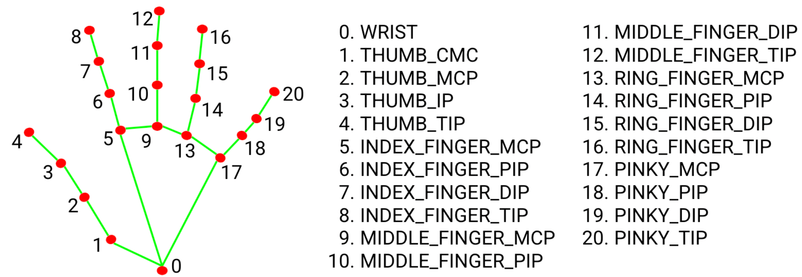
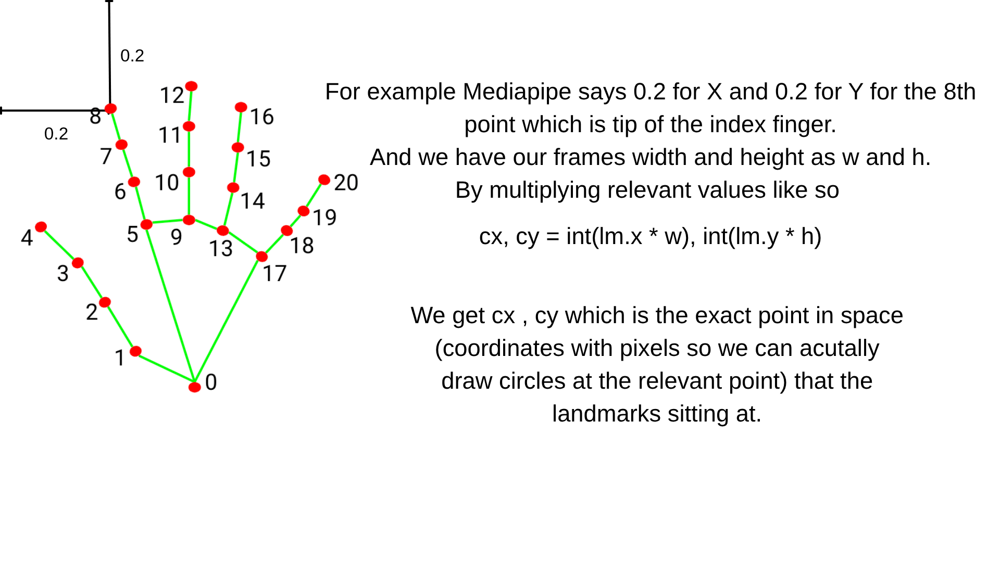
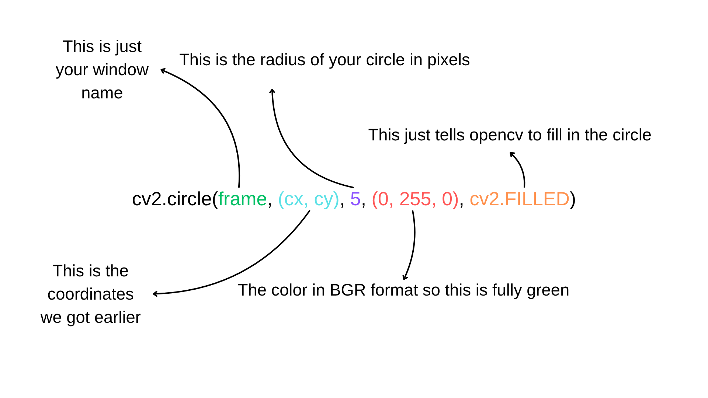
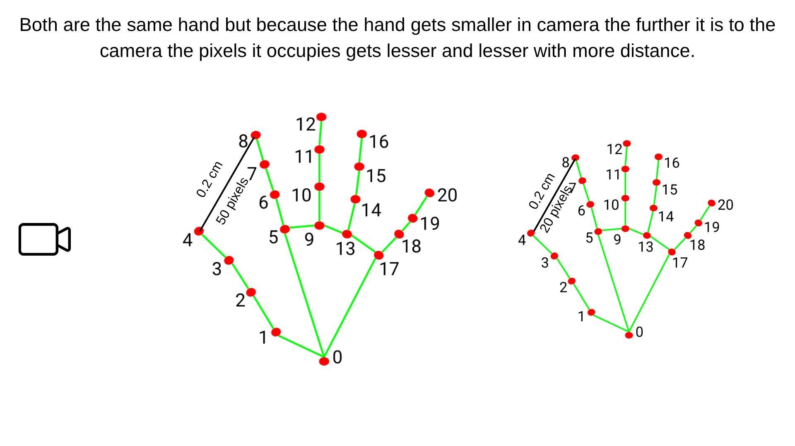
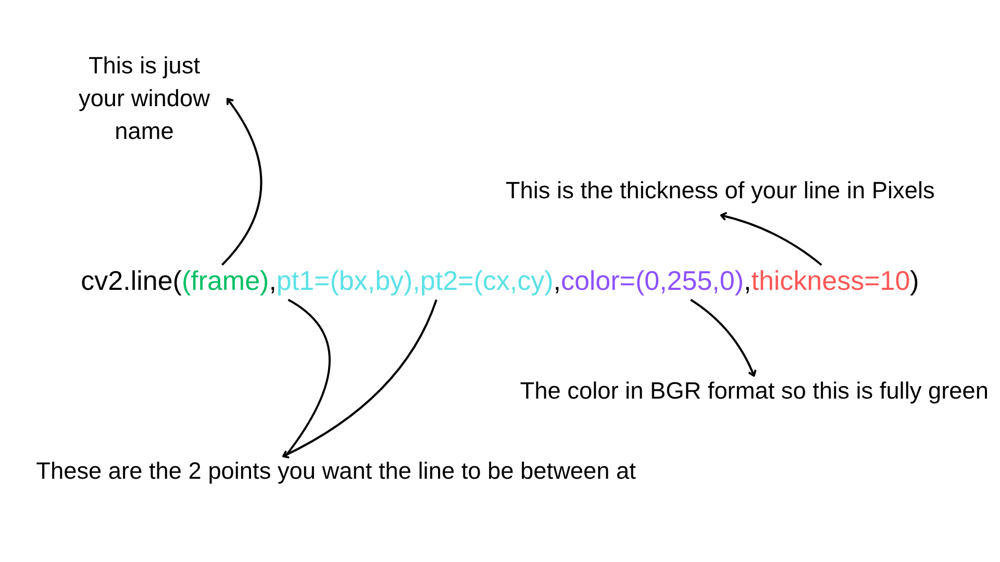

# MorbidVisuals
In this project we will explore Google's Mediapipe and see what we can do with it to alter realtime videos or normal videos in general.
First we need to download the Mediapipe library I will be using a venv for this and I suggest you do too.

for creating a venv you can use 

python -m venv yourenvname

And once you have done that you can activate the enviroment by 

source ./yourenvname/bin/activate(extension of this may change according to your terminal .fish/.ps1/.csh since i am rocking a fish terminal i will be using .fish)

then to install the mediapipe library you can type in

python -m pip install mediapipe

For our first project we will be doing just hand landmark tracking and projecting the hand landmarks with opencv.
Opencv is a powerful and useful library used in many projects that include computer vision,image processing and machine learning. You can download opencv using

python -m pip install opencv-python

to import mediapipe and opencv you can use 

import cv2
import mediapipe as mp
from mediapipe.tasks import python
from mediapipe.tasks.python import vision

!Important: Many tutorials that are older might include mediapipe.solutions() but that is deprecated I wouldn't recommend using this but you can through downloading older versions of the mediapipe library.

To get started with our hand landmarking project we first have to download a model from mediapipes model library you can get the basic hand landmark model using this command 

wget -q https://storage.googleapis.com/mediapipe-models/hand_landmarker/hand_landmarker/float16/1/hand_landmarker.task

Or you can get it through Mediapies own guide.
After that you should put your model path in your code

model_path = "your/path/to/your/hand_landmarker.task"

There are multiple settings you need to setup to use mediapipe and do hand landmark detection some of those are 

BaseOptions = mp.tasks.BaseOptions
HandLandmarker = mp.tasks.vision.HandLandmarker
HandLandmarkerOptions = mp.tasks.vision.HandLandmarkerOptions

options = HandLandmarkerOptions(
    base_options=BaseOptions(model_asset_path=model_path), # You could just put the model path here but i did it like this to keep this part organized
    running_mode=mp.tasks.vision.RunningMode.IMAGE, # Specifies running in single frame mode
    num_hands=2 #Just specifies the number of hands
)

İf you want more configuration you might like looking at https://developers.google.com/edge/mediapipe/solutions/vision/gesture_recognizer which also has a lot of useful information in general.
and for opencv we need to setup our window and our video source 

cam = cv.VideoCapture(0) #Setting up the camera you might need to change the value in the parenthesis to use other video sources you have connected for example for me it was 2 because i used Iriun webcam
cam.set(3, 1280)#setting width
cam.set(4, 720)#setting height

Now that we are fully set up we can do our landmark detection by using the mp.image to pass our frame to the landmarker model and get the results (we also turn the image to RGB while doing so)

After that we use the results we get alongside the width and height attributes of our frame and use those values times each other to draw circles on the coordinates that the landmarks are. But before we jump into there I want to talk about what info we get from mediapipe.

We get 21 distinct landmarks we can use to make all kinds of applications such as basic gesture recognition ,a dynamic drawing tool or a tool that uses your hand as a volume knob for your pc(all off which we will try to do in this project)

Now lets get back to our own first try of just displaying the hand landmarks.

We get the cx and cy coordinates then draw circles around them with the simple cv2.circle function

then we can just show our frame, add a stopping and a cleanup logic at the end 
        cv2.imshow("Show Video", cv2.flip(frame, 1))
        if cv2.waitKey(1) & 0xFF == ord('q'): break

cam.release()
cv2.destroyAllWindows()

There we go now we can display our hand landmarks correctly and accurately. In the next project we will use these hand landmarks to draw with our fingers.

Now we can use the information we learned and explore the result function a bit further.
<h1>Learning fundementals of result and experimenting</h1>
The setup for our project remains the same until the circle drawing logic. To understand how we can take info of 21 distinct points we have to look at how the results function works.
We have 2 main uses of our results the first function is result.hand_world_landmarks and the other is result.hand_landmarks The difference beetween these 2 functions are the world landmarks gives distance relative to your hands wrist in metric format while the normal hand landmark function gives you normalized coordinates(1-0) relative to your cameras width and height. 

But why do we need the world hand landmark when we can just use normal hand landmark. 

As you can see in the image the distance between the 2 points stays same but the pixels get lesser and lesser so we cant rely on the frame relative hand_landmark function and we must use the hand relative hand_world_landmark to get the distance between the two fingers so we can use them later in the code.

To get one points location we need to call it from the results then assign it to a variable to use it more efficiently
jointA = result.hand_world_landmarks[0][8] # specifying the exact point of 08 which is index tip
jointB = result.hand_world_landmarks[0][4] # specifying the exact point of 04 which is thumb tip
x1,y1,z1 = jointA.x,jointA.y,jointA.z
x2,y2,z2 = jointB.x,jointB.y,jointB.z
we can then use these values to check if the finger tips are close together 
if abs(x1 - x2) <0.015 and abs(y1 - y2) <0.008 :# you might need to mess with these values to make them work better
    print("Finger tips are close together")
then we need something else to make our script more fun. What about drawing a line from the thumb tip to index tip everytime we dont detect a pinch and for that we need the frame relative hand_landmark positions we get those by 

jAnormal = result.hand_landmarks[0][8]
jBnormal = result.hand_landmarks[0][4]

and we get the needed values and assign them to variables with

h,w,_=frame.shape
bx = int(jBnormal.x*w)
by = int(jBnormal.y*h)
cx = int(jAnormal.x*w)
cy = int(jAnormal.y*h)

and after that we just add a else after our circle drawing logic which just means we will do this everytime we aren't pinching. And also use the cv2.line function to draw a line between 2 points the basic parameters for cv2.line is 

Then we can just show the image and add the cleanup code and there you have your line drawing pinch detecting circle drawing code ready at your fingertips.